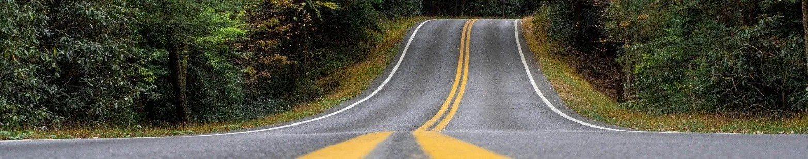

# 🚏 Road Signs Deep Learning classification 



---

## Table of Contents

-   [Technologies Used](#technologies-used)
-   [Description](#description)
-   [Objectives](#objectives)
<!-- -   [Presentation](#presentation) -->
-   [Notebooks Overview](#notebooks-overview)
-   [Installation](#installation)
-   [Usage](#usage)
-   [Project Structure](#project-structure)
-   [Collaborators](#collaborators)
-   [License](#license)

---

## Technologies Used

       

---

## Description
This project aims to classify road signs using a Convolutional Neural Network (CNN), important for autonomous driving systems. The GTSRB dataset is used, with data augmentation and model optimization techniques applied to improve performance.

### Objectives
The primary goal is to accurately classify road signs while exploring various techniques to improve the model's performance.

1. **Preprocess and augment the GTSRB dataset.**
2. **Design, train, and evaluate the CNN model.**
3. **Optimize performance with techniques like regularization and transfer learning.**
4. **Interpret the model predictions and evaluation results.**

### Dataset

The **GTSRB dataset** contains 50,000+ images of road signs. It will be split into training, validation, and test sets with data augmentation to increase robustness & generalization.
[Dataset-Link](https://www.kaggle.com/datasets/meowmeowmeowmeowmeow/gtsrb-german-traffic-sign).

---
<!-- 
## Presentation

A **presentation** is available as a **PDF** file in the repo ```Movie_Recommendation_System_Presentation.pdf``` & also as a **Canva/Powerpoint** presentation through the following link: [Presentation Link](https://www.canva.com/design/DAGPvK0-A2g/1DJtvrzpoxdP5VG_GcgkhA/view?utm_content=DAGPvK0-A2g&utm_campaign=designshare&utm_medium=link&utm_source=editor).

--- -->

## Notebooks Overview

1. **Exploratory_Data_Analysis.ipynb**:
   - Provides a comprehensive analysis of the dataset, including visualizations and insights into user ratings, movie genres, and other key aspects.

2. **Models_Training.ipynb**:
   - Contains the implementation of various machine learning models for the classification task, including Convolutional Neural Networks (CNN). The notebook includes data preprocessing steps, model architecture, training routines, and hyperparameter tuning, such as adjusting learning rate and batch size, to improve model performance.

---


> [!IMPORTANT]
> The project was developed and tested on Python 3.11.6

To run this project locally, follow these steps:

1. Clone the repository:
```sh
git clone https://github.com/Medkallel/Road-Signs-Deep-Learning-Classification
cd Road-Signs-Deep-Learning-Classification
```
2. Install requirements:
```sh
pip install -r requirements.txt
```
> [!IMPORTANT]
> Download the dataset from the following link: [Dataset-Link](https://www.kaggle.com/datasets/meowmeowmeowmeowmeow/gtsrb-german-traffic-sign)
> And place it in the Data folder.

---

## Usage 

1. **Run the Models_Training.ipynb** notebook to preprocess the data, train and evaluate the model.

> **TIP:** The notebook may take a while to run and train the model. Uncomment the model loading in the evaluation part to skip the training.
---
## Project structure
```sh
📦 Road-Signs-Deep-Learning-Classification/
├── 📁Data/ # Contains the dataset
├── 📁Model/
│   └── 🗃️Road_Sign_Classification_Model.keras
├── 📓Exploratory_Data_Analysis.ipynb
├── 📓Model_Training.ipyn
├── 📄requirements.txt
├── 📄README.md
├── 📄Project_Report.pdf
├── 📄Project_Presentation.pdf
│── 📄.gitignore
└── 🖼️banner.png
```
---


## Colaborators

This project was developed by a collaborative team. Each member played a crucial role in the research, development, and analysis:

- **Mohamed Kallel**
- **Jean Christophe Rigoni**
- **Simon Pierre Rodner**
---

## 📫 Contact me
<p>
<a href="https://www.linkedin.com/in/mohamed-kallel/">

</a> 
<br>
</p>

---


## License
This project is under the **CC BY-NC 4.0 License**. For more information, refer to the license file. <br/>
[](https://creativecommons.org/licenses/by-nc/4.0/)
